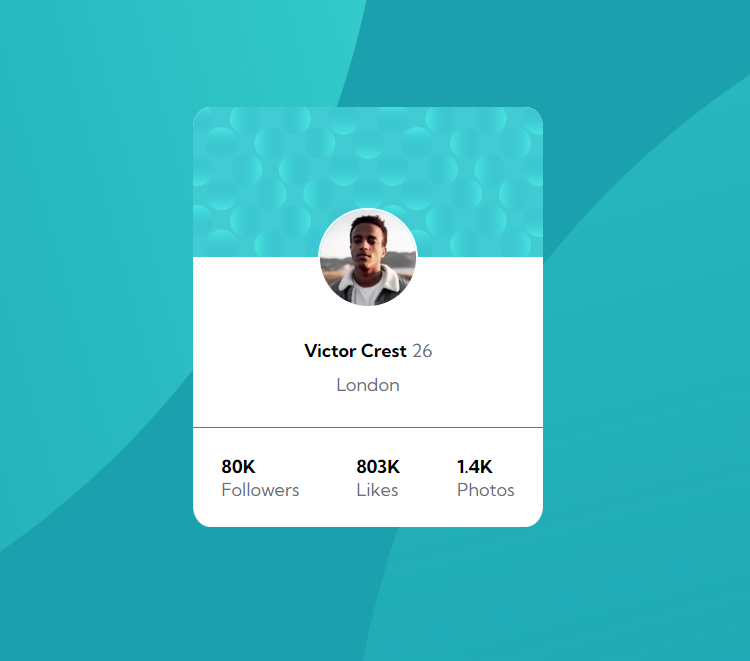
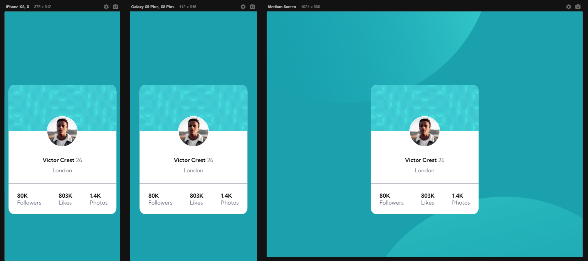

# Frontend Mentor - Profile card component solution

Solução do desafio [Profile card component challenge on Frontend Mentor](https://www.frontendmentor.io/challenges/profile-card-component-cfArpWshJ). O desafio foi proposto no curso DevQuest, com o objetivo de aprender HTML e CSS.

## Table of contents

- [Visao Geral](#isao-Geral)
  - [Sobre o desafio](#Sobre-o-desafio)
  - [Screenshot](#screenshot)
  <!-- - [Links](#links) -->
- [Sobre o processo](#Sobre-o-processo)
  - [Ferramentas utilizadas](#Ferramentas-utilizadas)
  - [O que eu aprendi](#O-que-eu-aprendi)
  - [Recursos úteis ](#Recursos-Úteis )
- [Autor](#Autor)
- [Conhecimentos](#Conhecimentos)

## Visao Geral

### Sobre o desafio

- Construir um cartão de perfil com as informções obtidas
### Screenshot
#### Desktop Screenshot

#### Responsive Viewer

<!-- ### Links

- Solution URL: [Add solution URL here](https://your-solution-url.com) -->

## Sobre o processo

### Ferramentas utilizadas

- HTML 5 
- Estilização com CSS
- Flexbox
- CSS Grid
- Responsividade

### O que eu aprendi

Aprendi como estruturar meu HTML e a utilizar a flex box do CSS para alinhar os elementos da tela, deixando muito mais fácil o posicionamento dos elementos.
Aprendi também a estilizar imagens de fundo utilizando o CSS.

### Recursos Úteis 
- [Utilização de SVGs](https://www.freecodecamp.org/portuguese/news/como-usar-imagens-svg-no-css-e-no-html-um-tutorial-for-beginners/#:~:text=Como%20usar%20imagens%20SVG%20em%20linha,body%3E%20de%20seu%20documento%20HTML.) - Me ensinou como utilizar Svg nos backgound-imgage

## Autor

- Linkedin - [Daniel Borguezani](https://www.linkedin.com/in/daniel-borguezani-903460223/)
- Frontend Mentor - [@Borguezani](https://www.frontendmentor.io/profile/Borguezani)
- GitHub - [@Borguezani](https://github.com/Borguezani)

## Conhecimentos

Apliquei todos os conhecimentos de HTML e CSS adiquiridos no curso DevQuest.
